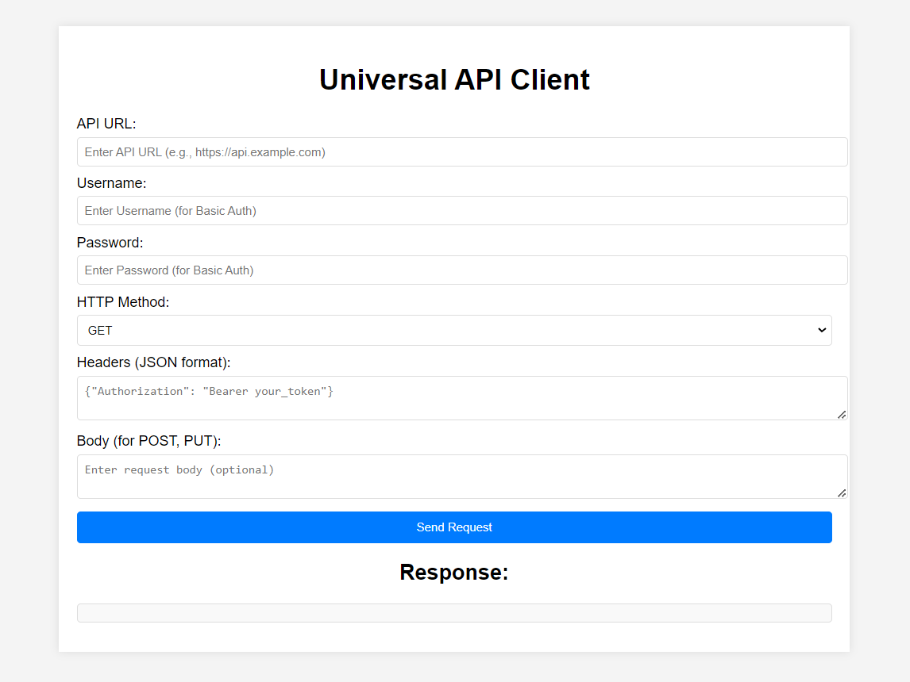
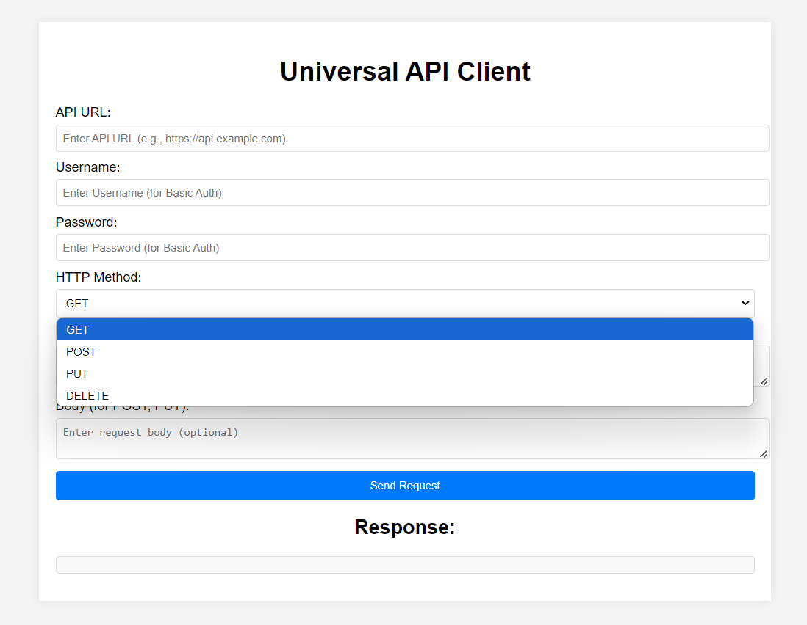

# REST API Test Dashboard Application

This REST API Test Dashboard application allows users to easily test and manage RESTful APIs. It offers a user-friendly interface similar to tools like Postman, enabling users to configure various HTTP methods, set headers, input request bodies, and manage authentication.

## Features
         
- **HTTP Methods Supported:** 
  - GET
  - POST
  - PUT
  - DELETE
  
- **Customizable Headers and Body:** 
  - Dynamically add headers and body content for API requests.

- **Authentication:**
  - Support for Basic Authentication (username/password) for API calls.

- **Response Preview:**
  - Displays server responses clearly in an expanded textarea for easy reading.

- **MySQL Integration:**
  - Every API request made (POST, PUT, DELETE, GET) is logged and saved into a MySQL database for future reference.

- **User-Friendly Interface:**
  - Designed for ease of use, allowing users to switch between request types and view results effortlessly.

## Technologies Used

- **Backend:** Java (Spring Boot)
- **Frontend:** HTML, CSS, JavaScript
- **Database:** MySQL
- **Dependencies:** Maven

## Installation and Setup

### Prerequisites

- Java 17 or higher
- MySQL installed and running
- Maven installed
- A working internet connection for dependency downloads

## Screenshots

Here are some screenshots of the application:

## How to Use

**Authorization:**

- Enter your username and password for Basic Authentication in the provided fields.

**HTTP Method:**

- Select the desired HTTP method (GET, POST, PUT, DELETE).

**Headers and Body:**

- Input headers and body content in the respective text areas.

**Make API Request:**

- Click on the button to send the request, and the server response will be displayed below.

**Track Requests:**

- All API requests are automatically saved in the MySQL database for future reference.

## Contributing

- Contributions are welcome! Please follow the standard GitHub workflow:

    - Fork the repository
    - Create a new feature branch
    - Make your changes and submit a pull request
 
## Contact

- For any queries or assistance, feel free to reach out at:
- Email: abhisam7007871@gmail.com
